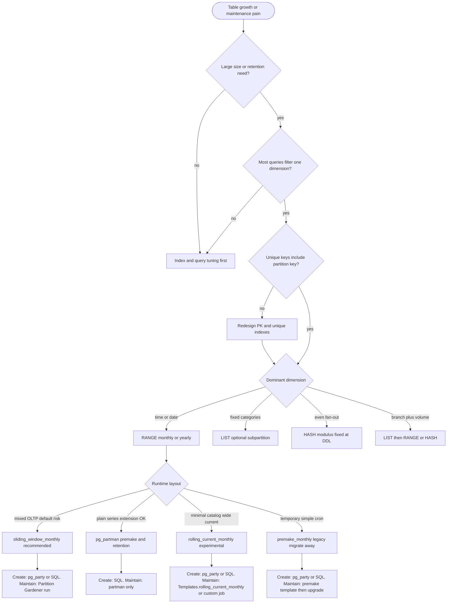

# Partition decision flow

This document describes how to decide whether a PostgreSQL table should be partitioned, which declarative method and runtime layout to use, and how that choice maps to Partition Gardener templates. It is written for operators and application authors who maintain large tables on plain PostgreSQL without a time-series extension.

The flow has four stages: whether to partition at all, which partition method fits the data shape, which maintenance layout fits the load, and which tools own DDL creation versus runtime maintenance. Reliability invariants apply at every stage.

## Stage zero: whether to partition

Most tables never need partitions. Partitioning adds catalog complexity, migration cost, and operational surface. Start here.

Defer partitioning when the table is small and growth is modest. A common practical band is below a few hundred megabytes on disk with no retention pressure and no recurring vacuum or reindex pain on the parent. In that band, indexes, query shape, and retention policy usually deliver more than partitions.

Defer partitioning when queries do not consistently filter on a single dominant dimension. If reports routinely scan wide date ranges, join many tenants in one query, or ignore the column you would partition on, the planner cannot prune children and you pay partition overhead without benefit. Plan those reports as snapshot or warehouse paths, not live OLTP aggregates.

Defer partitioning when the real problem is a missing index or an unbounded delete. Bulk delete followed by vacuum is the wrong motivation. Partitioning pays off when you can drop or detach whole children, or when per-child maintenance and pruning match how the application reads and writes.

Proceed toward partitioning when several signals agree. Table size or row count is large and still growing. You must archive or drop data by period. Most important queries include the same key you would partition on. Parent-level vacuum or index maintenance is painful. You can change primary or unique keys so every uniqueness constraint includes the partition key, which PostgreSQL requires for declarative partitions. Product surfaces can default to the same key (month picker, tenant context, date range) so routine use stays prune-friendly; see [partition_landscape.md](partition_landscape.md#ui-and-product-surfaces).

## Stage one: choose the partition method

The partition method follows access shape, not storage convenience.

Use range partitioning when time or calendar bounds dominate. Examples are created_at, occurred_on, order_date, and business dates cast to date. Reads and writes usually carry a bounded interval on that column. Retention is expressed as dropping or detaching months or years. This is the default case for operational and audit data in Rails applications.

Use list partitioning when the table splits into a small, stable set of categories that queries always filter on. Examples are region codes, product lines, or a fixed branch discriminator such as cached versus workspace-scoped rows. List is a poor fit when category membership changes often or when queries cross categories without filters.

Use hash partitioning when volume is high but no natural range or list dimension exists, and equality on a single key is the main access path. Hash spreads writes; it does not help time-range reports. Changing hash modulus is a major migration and should be rare.

Use composite partitioning when one dimension is stable and another needs fan-out inside each branch. A typical pattern is list at the parent for branch type, then range or hash on a high-cardinality key under each branch. This matches mixed workloads where one slice is global and cold and another is tenant-heavy and hot.

Before any method is chosen, resolve uniqueness. If the business unique key does not already include the partition key, redesign the primary key or unique indexes to composite form such as id plus partition key. Partitioning cannot proceed safely until that constraint work is done.

## Stage two: choose the runtime layout

Declarative method answers how PostgreSQL routes a row. Runtime layout answers how many children you keep attached, how far ahead you premake, and how you prevent rows from landing in the default partition.

Premake-only layout creates the current interval and the next interval, then drains the default partition on a schedule. It is simple and familiar in many codebases. It fails quietly when premake stops or when bounds leave holes: inserts route to default, and attach operations during cutover become fragile. Treat premake-only as a legacy stepping stone, not the long-term target for tables that matter.

Rolling current layout keeps one wide child spanning the current month and many months ahead, then rolls one month at a time into named archive children. It minimizes partition count in the catalog. It demands strict operational discipline: default stays empty, current holds future-dated rows, and monthly roll must not overlap archive bounds. Use only when catalog size is the overriding constraint and the team accepts manual semantics.

Sliding window with three areas is the recommended layout for date-keyed mixed OLTP. Archive holds finalized monthly children before the active window. Current holds a bounded active span, often twelve months, with optional heat-driven splits that carve hot months into dedicated children while gap fillers cover non-hot months. Future is a single open-ended child from the end of the active window to MAXVALUE. Default is mandatory and must trend toward zero rows. A planner reconciles the target tree each maintenance run so ranges do not overlap and do not leave holes.

Extension-managed premake through pg_partman fits plain monthly or id-based series when the hosting environment allows the extension and the table does not need custom current or open fillers. Partman owns premake and retention well. Do not run full custom layout repair on the same parent table without an explicit hybrid contract, or the two maintainers will fight over bounds and drops.

Hypertable-style chunk automation through a time-series extension fits pure metrics and analytics when extension cost and operations are acceptable. It is not a substitute for mixed OLTP where queries ignore time or where composite keys and default-partition maintenance dominate reliability work.

## Stage three: indicators that drive partition creation and sizing

Operators and maintainers watch a small set of indicators. None of them alone decides the design, but together they show when to create children, split buckets, or drop archive.

Watch default partition row count. Sustained rows in default mean the layout is wrong or premake lagged. Default should be a safety net, not a destination. Alert when default is non-zero at the start of a maintenance run.

Watch partition horizon. The upper bound of the latest non-default child should stay comfortably ahead of the maximum insert key. A common operational rule is at least thirty days of headroom for monthly partitions. Shorter horizon means premake or sliding-window rebalance is falling behind.

Watch per-bucket heat inside the active window. When a single month or band exceeds a row threshold on the order of tens to hundreds of thousands of rows, or grows large on disk, dedicate a child for that bucket inside the current zone rather than letting one wide filler absorb all traffic. When a dedicated child stays cold, merge policy may collapse it back, conservatively.

Watch attached child count. Hundreds of partitions increase planner work and schema cache pressure. Prefer a bounded active window and a single future tail over creating many months ahead as separate premade children.

Watch retention policy against archive age. When archive children are older than the policy allows, detach or drop them. Retention belongs in the maintenance story even when layout repair is automated. See [retention.md](retention.md) for detach vs drop, `retention_apply`, and compliance.

Watch query plans for partition pruning on realistic workloads. If pruning does not appear for the queries you care about, the partition key is wrong or the application contract is missing filters. See [partition_landscape.md](partition_landscape.md) for composite primary keys, Rails `query_constraints`, and filter patterns that avoid scanning all partitions.

## Stage four: tools and responsibilities

Separate DDL creation from runtime maintenance.

Use migration helpers such as pg_party or explicit SQL to create the partitioned parent, initial children, indexes, and default partition. At cutover, use a hot-switch migration pattern: shadow partitioned table, minimal premake, atomic rename, then hand off to runtime maintenance. Premake one month ahead at cutover is enough when nightly maintenance owns the window afterward.

Use Partition Gardener for runtime maintenance when you need sliding window layout, default drain last, heat splits inside current, and non-overlapping tail rebalance. Register each parent with partition key, conflict key, template, and thresholds. Run under a single maintainer per table with advisory locking.

Choose maintenance cadence per service, not as a global default. See [Maintenance cadence](#maintenance-cadence) below.

Use pg_partman when the table is a straightforward time or id series, the extension is available, and you do not need three-area layout. Pick one maintainer per table. If partman premakes and gardener also reshapes the same bounds, treat that as a configuration error unless hybrid layout-only mode is documented and implemented. See [tooling_split.md](tooling_split.md).

### Maintenance cadence

Nightly `run!` fits services where layout drift is cheap to repair and row moves are acceptable on a fixed schedule. That is the common case for sliding-window monthly tables with modest move volume and OLTP paths scoped to one or few buckets.

Indicator-driven maintenance fits services where periodic row moves are costly, replica lag is sensitive, or maintenance I/O competes with peak traffic. Those services still need partition layout, but they should not run `apply` on a calendar alone. Run `apply` only when audit indicators cross explicit thresholds (default rows, horizon, heat, gap warnings from [Stage three](#stage-three-indicators-that-drive-partition-creation-and-sizing)). Between runs, rely on premake headroom and application insert discipline to keep default near zero.

Indicator-driven services must treat aggregate snapshots as the hot-path contract, not an optional optimization. Dashboard totals, KPI cards, and cross-period rollups read from bucket-keyed snapshot tables with `computed_at` and drift checks; live `SUM` / `COUNT` across all children stays off request threads. Incremental snapshot updates on writes keep the open bucket current; bounded recompute jobs refresh closed buckets after maintenance moves rows. Without that layer, deferring maintenance forces users onto wide scans that partitioning was meant to avoid. See [partition_landscape.md](partition_landscape.md#aggregates-totals-and-snapshots).

Operational split:

- Nightly or daily: scheduled `run!` after business-date rollover; morning audit confirms invariants.
- Indicator-driven: scheduled read-only `audit` (hourly or daily); enqueue `run!` for one table when warnings persist or thresholds breach; keep snapshot recompute jobs on their own cadence and rerun affected buckets after high `rows_moved`.

Both cadences use the same Gardener primitives (`plan`, `audit`, `apply`, `run!`). The difference is when `apply` runs and how heavily the application depends on snapshots on hot paths.

Partition Gardener does not replace application query contracts. When child tables must co-locate with a parent on a business date, denormalize that date onto children and require it in filters and joins. The gem does not enforce that contract; migrations and reviews do.

## Reliability invariants

Whatever path the decision flow selects, these invariants stay the same.

Every partitioned parent has a default child attached. Maintenance targets zero rows in default after each run.

Every key value maps to exactly one non-default child after a successful maintenance run. No overlapping bounds and no gaps that force default routing.

Uniqueness constraints include the partition key.

One maintenance owner per parent table per run, guarded by advisory lock.

Retention uses detach or drop of whole children, not bulk delete across the parent, when the goal is to remove old periods.

After creating or reshaping children, analyze the parent when statistics matter for constraint exclusion, especially on large tables.

## Decision flow diagram

## Mapping to Partition Gardener

Call PartitionGardener.suggest_template with partition_key_column and conflict_key for a first-pass template and warnings. Date-like keys suggest sliding_window_monthly. Monotonic id keys suggest integer_window with a warning that date range is usually preferable when time filters exist.

Register the returned template in Registry unless hosting policy forces pg_partman for that table. Mark legacy templates explicitly when migrating from premake-only or rolling-current jobs; they log reliability warnings on register.

For cutover migrations, include Migration::HotSwitchConcern, resolve partition_config from Registry.hot_switch_partition_config when the table is already registered, and pass months_ahead of one at switch time.

## What this flow does not decide

It does not choose hardware, connection pooling, or read replicas. It does not replace index design. It does not mandate a time-series extension when plain PostgreSQL plus disciplined layout is enough. It does not absolve applications from including the partition key in scopes that must prune, or from shaping UI and APIs so users naturally work inside those bounds.

When in doubt, prefer fewer moving parts: range on a real access key, sliding window maintenance, empty default, one maintainer, and retention by dropping archive children once policy and backups allow.

## Related

- [configuration.md](configuration.md) — registry options and `maintenance_backend`
- [background_job.md](background_job.md) — schedule `run!` after layout is chosen
- [tooling_split.md](tooling_split.md) — pg_party, pg_partman, Gardener ownership
- [partition_landscape.md](partition_landscape.md) — application contract (pruning, UI, snapshots)
- [cutover.md](cutover.md) — hot-switch checklist
- [operations.md](operations.md) — post-go-live runbook
